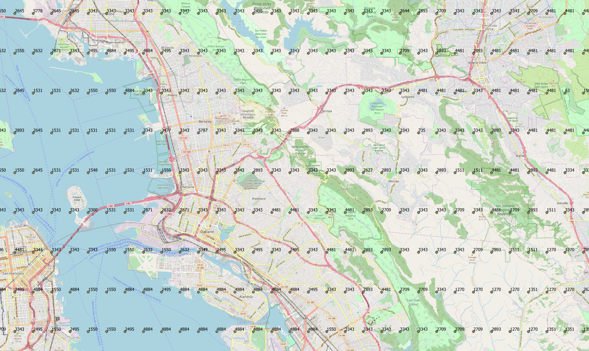

# SelectRecord
This application can be used to select and scale ground motion(GM) records from a database of existing records (e.g. NGA-West2). The application will take as an input a target spectrum, a database of records, an error metric and a short-listing criteria. The output would be either a single record or a suite of records. 

Initial version will use NGA-West flat file as a database to carry out selection/scaling. Later versions may include more record sources and automatic retrieval of the records. For the regional earthquake simulation, this application will select a single record to match a single simulated spectrum. The output of this application is the IDs of the selected records, scaling factors and error values for each site.

Optionally, the application can produce outputs in GeoJson format to facilitate visualization in GIS applications. The following figure shows the IDs of selected records using QGIS plotted for a grid over the SF bay area.



## Usage
SelectRecord can be executed as follows:

```shell
SelectRecord Config.json Output.json
```
This tool requires an input config file, to be provided the required information about the target spectrum, the ground motion database, the error metric used in the selection and a shortlisting criteria.

An example config file will look as follows:
```json
{
    "Target": {
        "Type": "SimulatedSpectrum",
        "File": "Scenario2_Sim.json"
    },
    "Database": {
        "Type": "CSV",
        "File": "NGAWest2.csv"
        },
    "Criteria": {
        "Magnitude": {
            "Min": 6.0,
            "Max": 8.0
        },
        "Distance": {
            "Min": 0.0,
            "Max": 50.0
        },
        "Vs30": {
            "Min": 400.0,
            "Max": 800.0
        }
    }
}
```

The target object in the configuration will specify the type of the target spectrum, and a ground motion file to read it from. Valid target spectrum types are `MeanSpectrum` and `SimulatedSpectrum`. 

The configuration file will also specify the GM records database to use. The only valid type is `CSV` file. In the future, other database types will be supported, such as `SQLite`. The database is required to provide a minimal set of information about the records, such as record id, EQ magnitude, spectral accelerations, rupture-site distance,  . An [example database](examples/NGAWest2.csv) in CSV format is created using NGA-West2 flatfile, and is included with this tool.

The criteria specifies the range of values for each of the EQ magnitude, the distance of the site from the EQ rupture and the site parameters Vs30. The provided ranges are used to shortlist the feasible candidates for selection.


## Examples
### Selection and scaling of NGA-West2 records for a grid of sites in the SF Bay area
The input config file([GMSelection.json](examples/GMSelection.json)) for this example is specified as follows:
```json
{
    "Target": {
        "Type": "SimulatedSpectrum",
        "File": "Scenario2_SA_Sim.json"
    },
    "Database": {
        "Type": "CSV",
        "File": "NGAWest2.csv"
        },
    "Criteria": {
        "Magnitude": {
            "Min": 6.0,
            "Max": 8.0
        },
        "Distance": {
            "Min": 0.0,
            "Max": 50.0
        },
        "Vs30": {
            "Min": 400.0,
            "Max": 800.0
        }
    }
}
```

The target for this selection is the resulting output file([Scenario2_SA_Sim.json](examples/Scenario2_SA_Sim.json)) from SimulateGM example. This file contains spatially correlated simulations of the ground motion for a grid of sites in SF bay Area.

To run the selection and scaling, use this command:
```shell
SelectRecord GMSelection.json Scenario2_Records.json
```

The output file([Scenario2_Records.json](examples/Scenario2_Records.json)) is included in the examples folder. The output contains the record id selected for each site and the scaling factor.
The ids can be used to retrieve unscaled records from the NGA West 2 database.